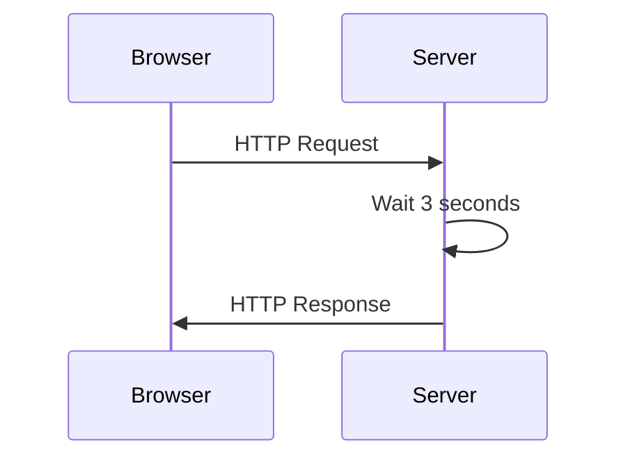

## What is this?

Sandbox repository for playing with [libuv](https://libuv.org/).

## Workspaces

- [`01.brainless-http-server/`](./01.brainless-http-server/)
    - Dead simple HTTP Server respond with 200 OK whatever you request.
- [`02.powered-by-libuv/`](./02.powered-by-libuv/)
    - Same thing as brainless-http-server but this uses libuv.

## Sequence

